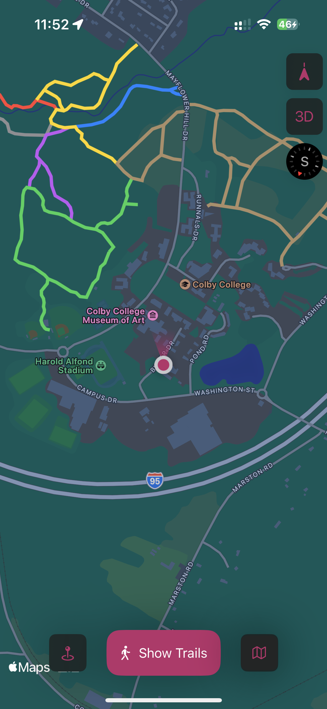

# Colby Trails Map App

This SwiftUI app displays interactive trail maps of the Perkins Arboretum surrounding Colby College, allowing users to view trails, their information, and their current location on the map. 

## Features

- 📍 User location tracking  
- 🗺️ Interactive map view with trail overlays 
- 🧾 Trail information cards (needs work)
- 🧭 Alternate map view options (satellite, terrain)

This app is *very much* a work in progress, and I have not had time to continue work on it. 

## Screenshot

## Project Files

This project includes the following SwiftUI components:

- `MapViewModel.swift`: Handles map logic and state
- `UserLocation.swift`: Manages user location updates
- `Trail.swift`: Defines trail data structures
- `TrailInfoCardView.swift`: Renders UI cards for trails
- `ContentView.swift`: Main entry view
- `MapView.swift` and `MapView2.swift`: Main map rendering components
- `TrailInfosView.swift`: View for multiple trail info cards
- `MapColbyTrailsApp.swift`: App entry point
